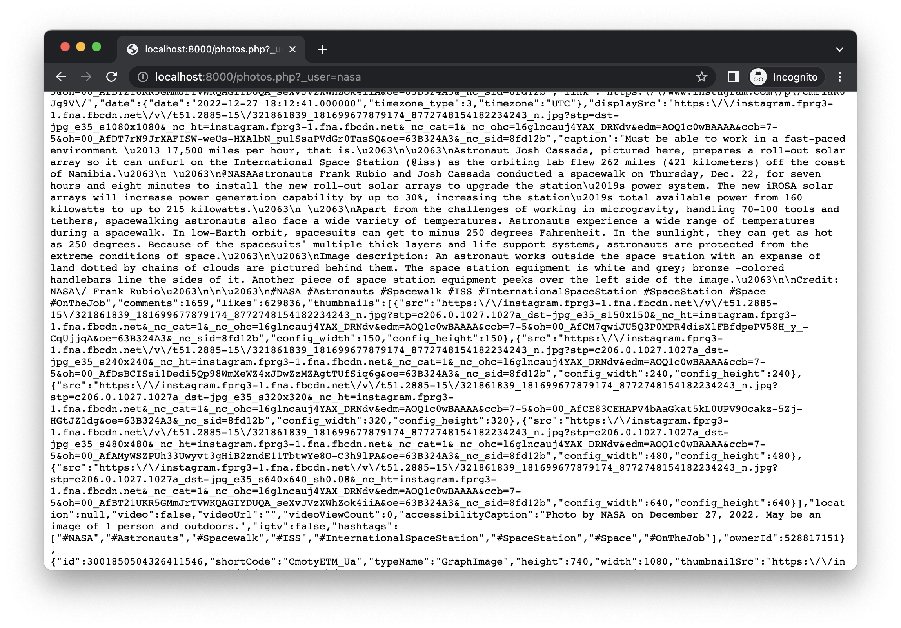

<h1 align=center>Instahost</h1>

   🐘 Little PHP for parsing instagram and serving it like REST JSON API.

🕹 <a href="https://f3l1x.io">f3l1x.io</a> | 💻 <a href="https://github.com/f3l1x">f3l1x</a> | 🐦 <a href="https://twitter.com/xf3l1x">@xf3l1x</a>

-----

## Usage

1. Clone or download this project.
2. Create `.env` file with credentials.
3. Install dependencies via `make install`.

## Example

- http://localhost:8000/photos.php?_user=nasa

## Development

- `make install` - install dependencies
- `make dev` - run project with development setup
- `make prod` - run project with production setup

See [how to contribute](https://contributte.org/contributing.html) to this package.

This package is currently maintained by these authors.

-----

Consider to [support](https://github.com/sponsors/f3l1x) **f3l1x**. Also thank you for using this package.
